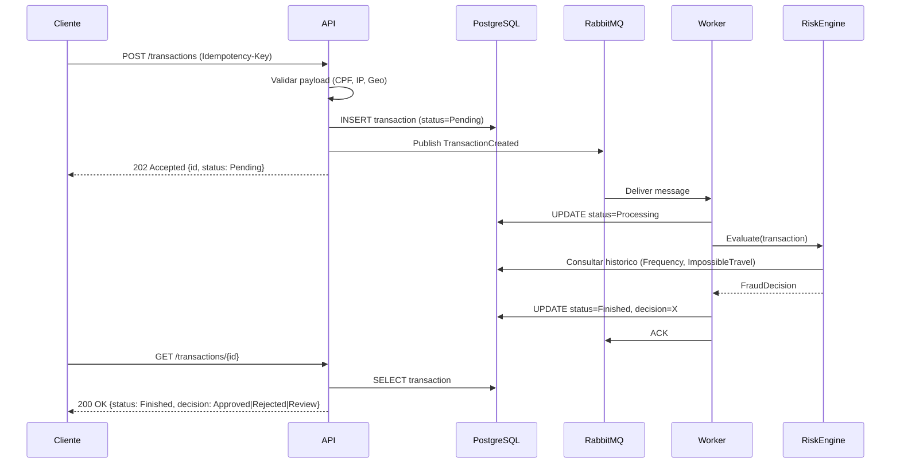
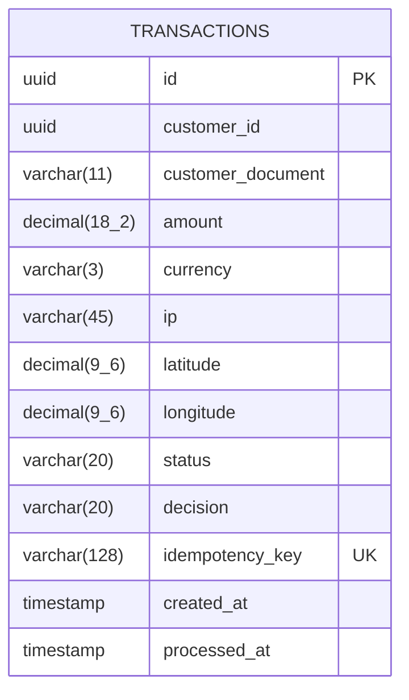

# FraudDecisionEngine

Motor de decisao antifraude para transacoes financeiras. Recebe transacoes via API REST, persiste com status pendente e delega a analise de risco a um Worker assincrono que aplica regras configuraveis e emite uma decisao (Approved, Rejected ou Review).

## Arquitetura

A solucao segue Clean Architecture dividida em 5 projetos:

| Projeto | Responsabilidade |
|---------|-----------------|
| `FraudAnalysis.Domain` | Entidades, enums e interfaces de dominio. Zero dependencias externas. |
| `FraudAnalysis.Application` | DTOs, validadores, interfaces de servico e logica de orquestracao. |
| `FraudAnalysis.Infrastructure` | Persistencia (EF Core + PostgreSQL), mensageria (RabbitMQ), repositorios. |
| `FraudAnalysis.Api` | API REST ASP.NET Core. Recebe transacoes e expoe consultas. |
| `FraudAnalysis.Worker` | BackgroundService que consome a fila, executa o RiskEngine e atualiza o banco. |

Dependencias entre camadas:

```
Api / Worker
    |
    v
Application
    |
    v
Domain <── Infrastructure (implementa interfaces do Domain)
```

## Fluxo de ponta a ponta

1. Cliente envia `POST /transactions` com header `Idempotency-Key`.
2. API valida o payload (CPF, IP, geolocalizacao), persiste a transacao com status `Pending`.
3. API publica evento `TransactionCreated` na fila RabbitMQ.
4. API retorna `202 Accepted` com o Id da transacao.
5. Worker consome a mensagem, atualiza status para `Processing`.
6. RiskEngine executa todas as regras (SuspiciousAmount, HighValue, Frequency, PrivateIp, ImpossibleTravel, OffHours).
7. Worker persiste a decisao e atualiza status para `Finished`.
8. Cliente consulta `GET /transactions/{id}` para obter o resultado.

## Diagrama de Componentes

```mermaid
graph LR
    Client[Cliente] -->|POST /transactions| API[FraudAnalysis.Api]
    Client -->|GET /transactions/id| API
    API -->|Publish| RabbitMQ[(RabbitMQ)]
    RabbitMQ -->|Consume| Worker[FraudAnalysis.Worker]
    API -->|Read/Write| PostgreSQL[(PostgreSQL)]
    Worker -->|Read/Write| PostgreSQL
    Worker -->|Expose :9090| Prometheus[/metrics]
```

## Diagrama de Sequencia



## Diagrama ER



**Indices:**
- `ix_transactions_idempotency_key` (UNIQUE) - garante idempotencia no nivel do banco.

## Idempotencia e Deduplicacao

A API exige o header `Idempotency-Key` (UUID) em toda requisicao `POST /transactions`.

Estrategia:
1. O `TransactionService` busca no banco uma transacao com a mesma chave.
2. Se existir, retorna a transacao original sem criar duplicata.
3. Se nao existir, cria a transacao normalmente.
4. Indice UNIQUE em `idempotency_key` garante consistencia mesmo sob race conditions.

Dessa forma, retries do cliente (timeout de rede, falha parcial) nunca geram duplicatas.

Referencia: [ADR-003](docs/adr/ADR-003-idempotencia.md)

## Resiliencia

O sistema implementa multiplos mecanismos de resiliencia:

| Mecanismo | Onde | Descricao |
|-----------|------|-----------|
| Retry com backoff exponencial | Worker/Consumer | Mensagens que falham sao reprocessadas com intervalos crescentes. |
| Dead Letter Queue (DLQ) | RabbitMQ | Mensagens que excedem o limite de retries vao para a DLQ para investigacao. |
| Circuit Breaker | Infrastructure (Polly) | Protege chamadas ao banco e servicos externos contra falhas em cascata. |
| ACK/NACK manual | Worker | Mensagem so recebe ACK apos persistencia bem-sucedida; NACK devolve para a fila. |
| Healthchecks | Docker Compose | PostgreSQL e RabbitMQ possuem healthchecks; servicos so iniciam quando dependencias estao saudaveis. |

## Observabilidade

**Metricas Prometheus (Worker, porta 9090):**

| Metrica | Tipo | Descricao |
|---------|------|-----------|
| `fraud_transactions_processed_total` | Counter | Transacoes processadas, rotuladas por decisao. |
| `fraud_transactions_failed_total` | Counter | Falhas no processamento de mensagens. |
| `fraud_transaction_processing_duration_ms` | Histogram | Duracao do processamento por transacao. |
| `fraud_messages_in_flight` | Gauge | Mensagens sendo processadas simultaneamente. |

**Logs estruturados:**
- Formato JSON via Microsoft.Extensions.Logging.
- Correlacao por `TransactionId` em todas as etapas.
- Niveis: Debug (regras avaliadas), Information (decisao final), Warning (rejeicoes).

**Endpoint:** `http://worker:9090/metrics` (scraping Prometheus).

## Validacoes na API

O payload `CreateTransactionRequest` implementa `IValidatableObject` com validacoes em camadas:

| Campo | Validacao |
|-------|-----------|
| `CustomerDocument` | Algoritmo oficial da Receita Federal (digitos verificadores). Rejeita CPFs com todos digitos iguais. |
| `Ip` | Deve ser um endereco IPv4 ou IPv6 sintaticamente valido (`System.Net.IPAddress.TryParse`). |
| `Latitude` / `Longitude` | Nao podem ser ambos zero (Null Island). Range: latitude [-90, 90], longitude [-180, 180]. |
| `Amount` | Maior que zero. |
| `Currency` | Exatamente 3 caracteres (ISO 4217). |
| `CustomerId` | Obrigatorio (GUID). |

## Regras do Worker (RiskEngine)

O RiskEngine executa as regras na ordem de registro. Prioridade de decisao: Rejected > Review > Approved.

| Regra | Decisao | Condicao |
|-------|---------|----------|
| `SuspiciousAmountRule` | Rejected | Valor exatamente igual a R$ 100,00 (padrao de teste de cartao clonado). |
| `HighValueRule` | Review | Valor acima de R$ 10.000,00. |
| `FrequencyRule` | Rejected | Mais de 5 transacoes do mesmo cliente em 1 minuto. |
| `PrivateIpRule` | Review | IP de faixa privada (10.x, 192.168.x, 172.16-31.x). Rejected se IP invalido. |
| `ImpossibleTravelRule` | Rejected | Velocidade implicita entre duas transacoes > 1000 km/h. Review se > 500 km em < 2h. |
| `OffHoursRule` | Review | Transacao entre 00:00 e 05:00 (horario de Brasilia). |

Se nenhuma regra disparar, a transacao e aprovada automaticamente.

## Contrato da API

### POST /transactions

Submete uma transacao para analise de risco.

**Headers:**
- `Content-Type: application/json`
- `Idempotency-Key: <uuid>` (obrigatorio)

**Request Body:**

```json
{
  "customerId": "3fa85f64-5717-4562-b3fc-2c963f66afa6",
  "customerDocument": "52998224725",
  "amount": 1500.00,
  "currency": "BRL",
  "ip": "177.45.120.33",
  "latitude": -25.43,
  "longitude": -49.27
}
```

**Response 202 Accepted:**

```json
{
  "id": "a1b2c3d4-e5f6-7890-abcd-ef1234567890",
  "status": "Pending",
  "decision": null,
  "createdAt": "2026-07-13T20:00:00Z",
  "processedAt": null
}
```

**Response 400 Bad Request:** payload invalido ou header `Idempotency-Key` ausente.

### GET /transactions/{id}

Consulta o estado atual de uma transacao.

**Response 200 OK:**

```json
{
  "id": "a1b2c3d4-e5f6-7890-abcd-ef1234567890",
  "status": "Finished",
  "decision": "Approved",
  "createdAt": "2026-07-13T20:00:00Z",
  "processedAt": "2026-07-13T20:00:02Z"
}
```

**Response 404 Not Found:** transacao nao encontrada.

## Como rodar

### Docker Compose (recomendado)

```bash
docker compose up -d
```

Sobe PostgreSQL, RabbitMQ, API (porta 5000) e Worker.

**Servicos expostos:**
- API: http://localhost:5000
- RabbitMQ Management: http://localhost:15672 (guest/guest)
- Metricas Worker: http://localhost:9090/metrics

### Desenvolvimento local

```bash
# Subir apenas infraestrutura
docker compose up -d fraudanalysis.db fraudanalysis.rabbitmq

# Executar migrations
dotnet ef database update --project src/FraudAnalysis.Infrastructure --startup-project src/FraudAnalysis.Api

# Rodar API
dotnet run --project src/FraudAnalysis.Api

# Rodar Worker (outro terminal)
dotnet run --project src/FraudAnalysis.Worker
```

### Variaveis de ambiente

Configuradas via `.env` na raiz ou variaveis de ambiente do sistema:

| Variavel | Descricao | Padrao |
|----------|-----------|--------|
| `POSTGRES_USER` | Usuario PostgreSQL | postgres |
| `POSTGRES_PASSWORD` | Senha PostgreSQL | postgres |
| `POSTGRES_DB` | Nome do banco | fraud_analysis |
| `RABBITMQ_USER` | Usuario RabbitMQ | guest |
| `RABBITMQ_PASSWORD` | Senha RabbitMQ | guest |

## ADRs (Architecture Decision Records)

| ADR | Titulo |
|-----|--------|
| [ADR-001](docs/adr/ADR-001-postgresql.md) | Uso de PostgreSQL como banco de dados |
| [ADR-002](docs/adr/ADR-002-rabbitmq.md) | Uso de RabbitMQ como broker de mensageria |
| [ADR-003](docs/adr/ADR-003-idempotencia.md) | Estrategia de idempotencia via header + indice unico |
| [ADR-004](docs/adr/ADR-004-clean-architecture.md) | Adocao de Clean Architecture |
